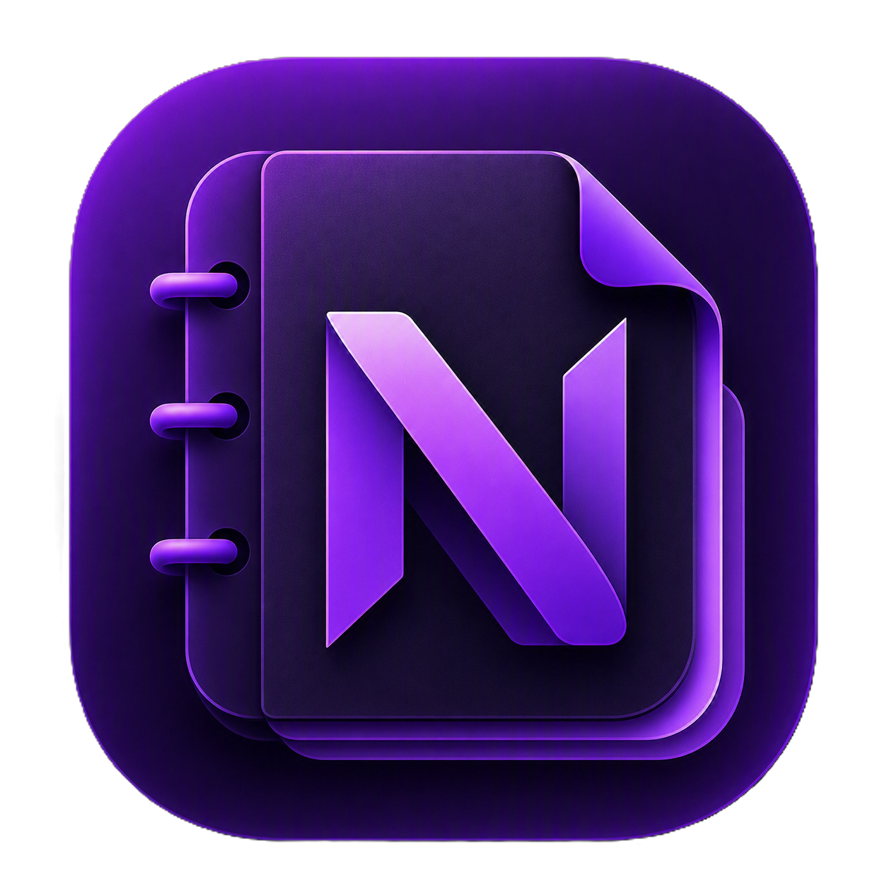
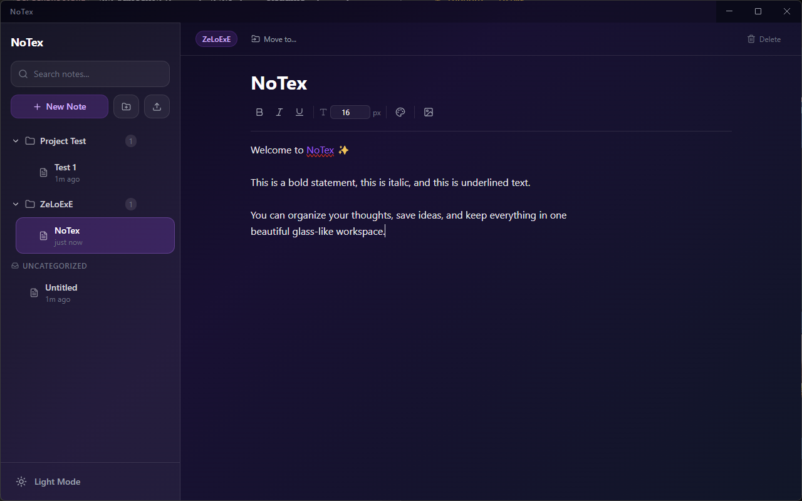

<p align="center"></p>
<h1 align="center">NoTex</h1>
<p align="center">A glassmorphism-styled desktop note-taking app</p>

---

## Screenshot

<p align="center"></p>

## Features

- **Glassmorphism UI** — frosted glass panels with backdrop blur, semi-transparent backgrounds, and soft shadows
- **Dark / Light theme** — dark mode by default, toggle to light mode with smooth transitions
- **Folder organization** — create folders, drag-and-drop notes into them, or use the "Move to" menu
- **Real-time search** — filters note titles and body text as you type
- **Rich text editing** — bold, italic, underline, per-selection font size (8–72 px), and text color picker
- **Inline images** — insert images from your device directly into a note
- **Note import** — import `.txt`, `.md`, and `.json` files via the native OS file dialog
- **Auto-save** — every change is debounced and saved to localStorage automatically
- **Windows desktop app** — packaged with Electron, built as an NSIS installer

## Tech Stack

| Layer | Technology |
|-------|-----------|
| Desktop shell | Electron |
| UI | React 19 (functional components + hooks) |
| Language | TypeScript |
| Styling | TailwindCSS v4 |
| Build | Vite 6 |
| Icons | lucide-react |
| Packaging | electron-builder (NSIS) |

## Installation / Download

### Download the installer

Grab the latest `.exe` installer from the [Releases](../../releases) page and run it.

### Build from source

```bash
git clone https://github.com/<your-username>/notex.git
cd notex
npm install
npm run dist
```

The installer will appear in `dist_electron/`.

## Development

Start the Vite dev server and Electron together:

```bash
npm install
npm run dev          # starts Vite on localhost:5173
npm run electron:dev  # builds and launches Electron (opens DevTools)
```

## License

MIT
